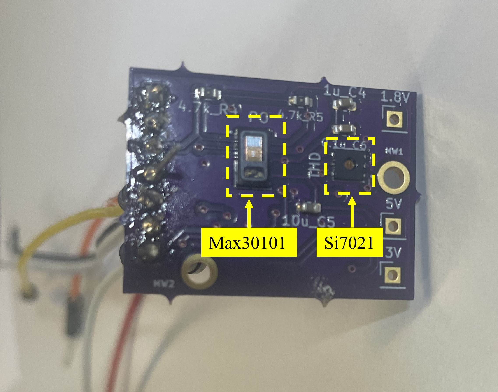

# Pulse Oximeter and Temperature-Humidity Sensor PCB

## Overview

This repository contains the design and firmware for a custom Printed Circuit Board (PCB) that integrates both a pulse oximeter and a temperature-humidity sensor. This PCB is designed to monitor vital physiological data, making it suitable for health monitoring and IoT applications.

### PCB Image

### Key Components:
- **Pulse Oximeter IC**: MAX30101
- **Temperature-Humidity IC**: Si7021
- **Voltage Regulators**: 5V, 1.8V

The PCB design ensures efficient power regulation and integrates sensor functionality in a compact, easy-to-use form.

## Components Description

### Pulse Oximeter (MAX30101)
- The MAX30101 is an integrated pulse oximetry and heart-rate monitor IC. It uses two LEDs (red and infrared) and a photodetector to measure blood oxygen saturation and heart rate.

### Temperature-Humidity Sensor (Si7021)
- The Si7021 is a digital temperature and humidity sensor with high accuracy and low power consumption. It provides environmental data that can be used to monitor air quality or adjust for environmental conditions in health monitoring applications.

### Voltage Regulators
- The PCB includes voltage regulation circuits for powering the sensors and components:
  - **5V Regulator**: For high logic level for MAX30101 operation
  - **1.8V Regulator**: For low logic level for MAX30101 operation

## Features
- **Compact design** that integrates both sensors on a single PCB.
- **Accurate physiological monitoring** using the MAX30100 pulse oximeter and the Si7021 temperature-humidity sensor.
- **Efficient power management** with onboard voltage regulators (5V and 1.8V).

## PCB Specifications
- **Design environment**: KiCad EDA 6.0.10
- **Dimensions**: Custom compact layout
- **Operating Voltage**: ~ 3V.
- **Interfaces**: I2C communication pins for data exchange between the sensors and microcontroller.
